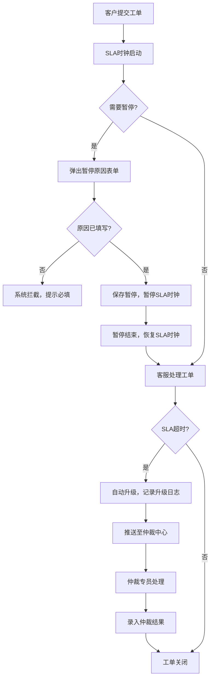

## 1. 产品概述

工单 SLA 升级仲裁系统是一套面向客户服务工单全链路管理平台，解决客户服务工单的 SLA 时效管理、自动升级仲裁、暂停原因追溯的企业级应用。核心解决客户工单等待超时无人处理、工单暂停无原因追溯的核心痛点。

- 主要用途：客户工单全生命周期管理、SLA 时效监控、自动升级仲裁、暂停原因审计
- 目标用户：客服专员、客服主管、仲裁专员、系统管理员
- 产品价值：提升客户满意度、规范服务流程、保障服务时效、实现服务过程可追溯

## 2. 核心功能

### 2.1 用户角色

| 角色 | 注册方式 | 核心权限 |
|------|----------|----------|
| 客服专员 | 系统分配 | 工单列表查询、工单详情查看、工单状态变更（处理/暂停）、暂停原因录入 |
| 客服主管 | 系统分配 | 所有客服权限 + 升级工单审核、仲裁结果录入 |
| 仲裁专员 | 系统分配 | 升级工单仲裁、仲裁结果录入、SLA 时效调整 |
| 系统管理员 | 系统分配 | 用户管理、权限配置、SLA 配置、数据初始化 |

### 2.2 功能模块

1. **工单列表页**：工单数据表格、筛选查询、SLA 状态标识、升级状态高亮、快速操作入口
2. **工单详情页**：工单基本信息、SLA 时钟实时显示、状态时间轴、暂停原因记录、升级记录、仲裁结果、状态变更操作区
3. **SLA 管理页**：SLA 时效规则配置、升级策略配置
4. **仲裁中心页**：待仲裁工单列表、仲裁操作、仲裁结果记录
5. **权限管理页**：角色管理、用户权限分配

### 2.3 页面详情

| 页面名称 | 模块名称 | 功能描述 |
|-----------|----------|----------|
| 工单列表页 | 数据表格 | 展示工单列表，支持分页、排序、筛选，SLA 超时/暂停/升级状态高亮显示 |
| 工单列表页 | 快速操作 | 查看详情、暂停工单、处理工单按钮 |
| 工单详情页 | 工单信息 | 展示工单基本信息、客户信息、问题描述 |
| 工单详情页 | SLA 时钟 | 实时倒计时显示、超时自动升级触发 |
| 工单详情页 | 暂停原因 | 暂停原因录入表单，无原因拦截校验 |
| 工单详情页 | 升级记录 | 升级时间、升级原因、处理人、升级级别 |
| 工单详情页 | 仲裁结果 | 仲裁意见、仲裁时间、仲裁人 |
| 工单详情页 | 状态变更 | 处理、暂停、升级、仲裁操作入口 |
| 仲裁中心页 | 待仲裁列表 | 待仲裁工单列表、批量仲裁操作 |
| 仲裁中心页 | 仲裁表单 | 仲裁结果录入、仲裁意见填写 |
| SLA 管理页 | SLA 规则配置 | SLA 时效配置、升级策略配置 |
| 权限管理页 | 角色权限 | 角色管理、用户权限分配 |

## 3. 核心流程

### 3.1 工单处理主流程

客户提交工单 → 系统启动 SLA 时钟 → 客服处理工单 → 若需暂停必须录入暂停原因 → 暂停结束恢复 SLA 时钟 → SLA 超时自动升级 → 升级至主管/仲裁 → 仲裁结果录入 → 工单关闭

### 3.2 异常拦截流程

1. **暂停无原因拦截**：用户点击暂停 → 弹出暂停原因表单 → 未填写原因点击保存 → 系统拦截并提示 → 必须填写原因后方可保存
2. **SLA 超时自动升级**：SLA 时钟倒计时 → 超时阈值触发 → 系统自动升级 → 记录升级日志 → 推送至仲裁中心 → 通知相关人员

## 4. 用户界面设计

### 4.1 设计风格

- 主色调：深蓝色 (#1e3a5f) 代表专业稳重的企业服务风格
- 辅助色：红色 (#e63946) 用于 SLA 超时告警，橙色 (#f4a261) 用于即将超时，绿色 (#2a9d8f) 用于正常状态
- 按钮风格：圆角 4px，悬停微动画效果
- 字体：使用 "Noto Sans SC" 作为标题字体，"Inter" 作为正文字体
- 布局风格：卡片式布局，顶部导航 + 左侧菜单 + 右侧内容区
- 图标风格：线性图标，状态图标使用鲜明色彩区分

### 4.2 页面设计概述

| 页面名称 | 模块名称 | UI 元素 |
|-----------|----------|----------|
| 工单列表页 | 数据表格 | 斑马纹表格行、状态标签、操作按钮组、SLA 进度条、超时红色闪烁 |
| 工单列表页 | 筛选区 | 下拉筛选、日期范围、搜索框、重置按钮 |
| 工单详情页 | 头部信息 | 工单编号、状态标签、创建时间 |
| 工单详情页 | SLA 时钟 | 大号数字倒计时、进度条、超时红色渐变背景 |
| 工单详情页 | 时间轴 | 垂直时间轴展示状态流转 |
| 工单详情页 | 暂停原因表单 | 必填星号、错误提示红色边框、保存按钮 |
| 工单详情页 | 操作区 | 按钮组、权限控制禁用状态 |
| 仲裁中心页 | 仲裁列表 | 待仲裁红色高亮、仲裁操作按钮 |
| 仲裁中心页 | 仲裁弹窗 | 表单、仲裁意见、保存/取消按钮 |

### 4.3 响应式

- 桌面端优先设计，适配 1920px 及以上
- 平板端自适应布局收缩，菜单可折叠
- 移动端单列布局，表格横向滚动
- 触摸操作优化，按钮最小 44px 点击区域

## 5. 异常分支处理

### 5.1 暂停无原因拦截

- 前端校验：暂停原因输入框标记为必填，前端表单校验
- 后端校验：API 层二次校验，无原因返回 400 错误
- 错误提示：红色边框 + 错误文字提示

### 5.2 SLA 超时自动升级

- 后端定时任务每分钟扫描超时工单
- 自动设置升级状态，记录升级日志
- 前端实时轮询 SLA 状态，超时自动刷新页面状态

### 5.3 权限控制

- 后端中间件校验权限，无权限返回 403
- 前端按钮根据权限禁用/隐藏操作按钮

## 6. 数据初始化

- 初始化 3 个测试工单（正常、即将超时、已超时）
- 初始化 4 个测试用户（客服、主管、仲裁、管理员）
- 初始化 SLA 规则（普通工单 24 小时，升级阈值 80%）
