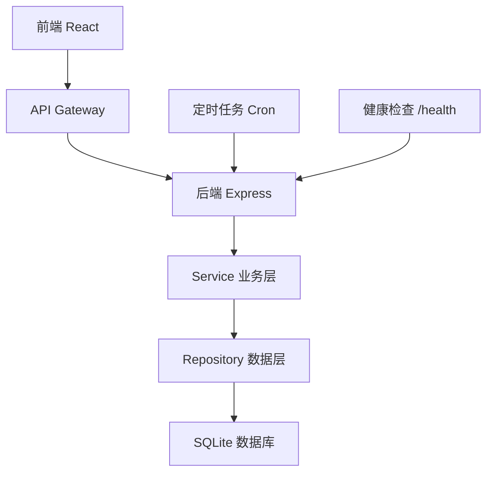
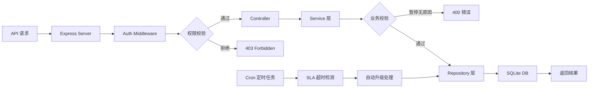
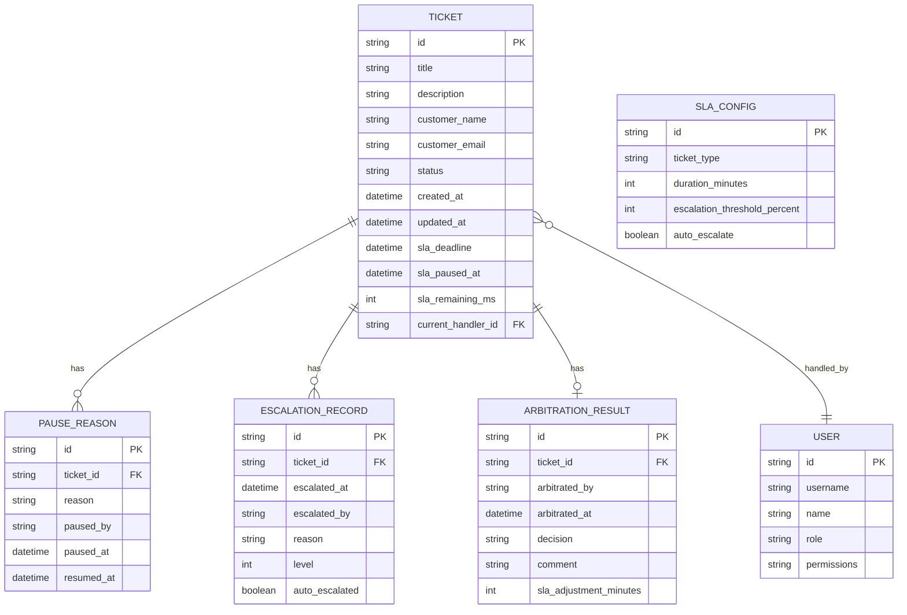

## 1. 架构设计



## 2. 技术描述

- 前端：React@18 + TypeScript + Vite + React Router + axios + TailwindCSS@3
- 后端：Node.js + Express@4 + TypeScript + cors + helmet
- 数据库：SQLite3 + better-sqlite3（同步操作，性能优异）
- ORM：直接使用 SQL 语句，无需额外 ORM 层，保持轻量
- 定时任务：node-cron，每分钟扫描 SLA 超时工单
- 容器化：Docker + docker-compose
- 状态管理：React Context + useReducer

### 2.1 项目结构

```
project-root/
├── frontend/                    # 前端应用
│   ├── src/
│   │   ├── components/         # 公共组件
│   │   ├── pages/              # 页面组件
│   │   ├── contexts/           # React Context
│   │   ├── services/           # API 调用
│   │   ├── types/              # TypeScript 类型
│   │   ├── utils/              # 工具函数
│   │   └── App.tsx
│   ├── package.json
│   └── vite.config.ts
├── backend/                     # 后端应用
│   ├── src/
│   │   ├── controllers/        # 控制器层
│   │   ├── services/           # 业务逻辑层
│   │   ├── repositories/       # 数据访问层
│   │   ├── middleware/         # 中间件
│   │   ├── database/           # 数据库初始化
│   │   ├── types/              # TypeScript 类型
│   │   ├── cron/               # 定时任务
│   │   └── server.ts
│   ├── package.json
│   └── tsconfig.json
├── docker-compose.yml
├── Dockerfile.frontend
├── Dockerfile.backend
└── delivery.md                 # 交付说明
```

## 3. 路由定义

| 路由 | 页面 | 权限 |
|------|------|------|
| / | 工单列表页 | 所有登录用户 |
| /tickets/:id | 工单详情页 | 所有登录用户 |
| /arbitration | 仲裁中心页 | 仲裁专员/主管 |
| /sla-config | SLA 配置页 | 管理员 |
| /permissions | 权限管理页 | 管理员 |
| /login | 登录页 | 公开 |

## 4. API 定义

### 4.1 TypeScript 类型定义

```typescript
// 工单状态
type TicketStatus = 'open' | 'processing' | 'paused' | 'escalated' | 'arbitrated' | 'closed';

// 工单
interface Ticket {
  id: string;
  title: string;
  description: string;
  customerName: string;
  customerEmail: string;
  status: TicketStatus;
  createdAt: string;
  updatedAt: string;
  slaDeadline: string;
  slaPausedAt?: string;
  slaRemainingMs: number;
  currentHandlerId?: string;
}

// 暂停原因
interface PauseReason {
  id: string;
  ticketId: string;
  reason: string;
  pausedBy: string;
  pausedAt: string;
  resumedAt?: string;
}

// 升级记录
interface EscalationRecord {
  id: string;
  ticketId: string;
  escalatedAt: string;
  escalatedBy?: string;
  reason: string;
  level: number; // 1: 主管, 2: 仲裁
  autoEscalated: boolean;
}

// 仲裁结果
interface ArbitrationResult {
  id: string;
  ticketId: string;
  arbitratedBy: string;
  arbitratedAt: string;
  decision: 'approve' | 'reject' | 'adjust';
  comment: string;
  slaAdjustmentMinutes?: number;
}

// SLA 配置
interface SlaConfig {
  id: string;
  ticketType: string;
  durationMinutes: number;
  escalationThresholdPercent: number;
  autoEscalate: boolean;
}

// 用户
interface User {
  id: string;
  username: string;
  name: string;
  role: 'agent' | 'supervisor' | 'arbitrator' | 'admin';
  permissions: string[];
}
```

### 4.2 API 接口

| 方法 | 路径 | 描述 | 权限 |
|------|------|------|------|
| GET | /api/tickets | 获取工单列表 | 所有 |
| GET | /api/tickets/:id | 获取工单详情 | 所有 |
| POST | /api/tickets | 创建工单 | 所有 |
| PUT | /api/tickets/:id | 更新工单 | 所有 |
| POST | /api/tickets/:id/pause | 暂停工单（必须传 reason） | 所有 |
| POST | /api/tickets/:id/resume | 恢复工单 | 所有 |
| POST | /api/tickets/:id/process | 标记处理中 | 所有 |
| POST | /api/tickets/:id/escalate | 手动升级 | 主管+ |
| POST | /api/tickets/:id/arbitrate | 仲裁 | 仲裁+ |
| POST | /api/tickets/:id/close | 关闭工单 | 所有 |
| GET | /api/tickets/:id/pause-reasons | 获取暂停原因记录 | 所有 |
| GET | /api/tickets/:id/escalations | 获取升级记录 | 所有 |
| GET | /api/tickets/:id/arbitration | 获取仲裁结果 | 所有 |
| GET | /api/sla-config | 获取 SLA 配置 | 管理员 |
| PUT | /api/sla-config | 更新 SLA 配置 | 管理员 |
| POST | /api/auth/login | 登录 | 公开 |
| GET | /api/health | 健康检查 | 公开 |
| GET | /api/users | 获取用户列表 | 管理员 |

### 4.3 暂停工单 API 校验逻辑

```typescript
// POST /api/tickets/:id/pause
interface PauseTicketRequest {
  reason: string; // 必填，后端强制校验
  pausedBy: string;
}

// 校验逻辑：
// 1. reason 字段不存在 -> 返回 400 { error: '暂停原因为必填字段' }
// 2. reason 为空字符串或全空格 -> 返回 400 { error: '暂停原因不能为空' }
// 3. reason 长度小于 5 字符 -> 返回 400 { error: '暂停原因至少5个字符' }
```

## 5. 服务器架构图



## 6. 数据模型

### 6.1 ER 图



### 6.2 DDL 语句

```sql
-- 用户表
CREATE TABLE IF NOT EXISTS users (
  id TEXT PRIMARY KEY,
  username TEXT UNIQUE NOT NULL,
  name TEXT NOT NULL,
  role TEXT NOT NULL CHECK (role IN ('agent', 'supervisor', 'arbitrator', 'admin')),
  permissions TEXT NOT NULL DEFAULT '[]',
  password_hash TEXT NOT NULL,
  created_at DATETIME DEFAULT CURRENT_TIMESTAMP
);

-- 工单表
CREATE TABLE IF NOT EXISTS tickets (
  id TEXT PRIMARY KEY,
  title TEXT NOT NULL,
  description TEXT NOT NULL,
  customer_name TEXT NOT NULL,
  customer_email TEXT NOT NULL,
  status TEXT NOT NULL DEFAULT 'open' CHECK (status IN ('open', 'processing', 'paused', 'escalated', 'arbitrated', 'closed')),
  created_at DATETIME DEFAULT CURRENT_TIMESTAMP,
  updated_at DATETIME DEFAULT CURRENT_TIMESTAMP,
  sla_deadline DATETIME NOT NULL,
  sla_paused_at DATETIME,
  sla_remaining_ms INTEGER NOT NULL DEFAULT 0,
  current_handler_id TEXT REFERENCES users(id)
);

-- 暂停原因表
CREATE TABLE IF NOT EXISTS pause_reasons (
  id TEXT PRIMARY KEY,
  ticket_id TEXT NOT NULL REFERENCES tickets(id) ON DELETE CASCADE,
  reason TEXT NOT NULL,
  paused_by TEXT NOT NULL REFERENCES users(id),
  paused_at DATETIME DEFAULT CURRENT_TIMESTAMP,
  resumed_at DATETIME
);

-- 升级记录表
CREATE TABLE IF NOT EXISTS escalation_records (
  id TEXT PRIMARY KEY,
  ticket_id TEXT NOT NULL REFERENCES tickets(id) ON DELETE CASCADE,
  escalated_at DATETIME DEFAULT CURRENT_TIMESTAMP,
  escalated_by TEXT REFERENCES users(id),
  reason TEXT NOT NULL,
  level INTEGER NOT NULL DEFAULT 1 CHECK (level IN (1, 2)),
  auto_escalated BOOLEAN NOT NULL DEFAULT false
);

-- 仲裁结果表
CREATE TABLE IF NOT EXISTS arbitration_results (
  id TEXT PRIMARY KEY,
  ticket_id TEXT NOT NULL UNIQUE REFERENCES tickets(id) ON DELETE CASCADE,
  arbitrated_by TEXT NOT NULL REFERENCES users(id),
  arbitrated_at DATETIME DEFAULT CURRENT_TIMESTAMP,
  decision TEXT NOT NULL CHECK (decision IN ('approve', 'reject', 'adjust')),
  comment TEXT NOT NULL,
  sla_adjustment_minutes INTEGER DEFAULT 0
);

-- SLA 配置表
CREATE TABLE IF NOT EXISTS sla_config (
  id TEXT PRIMARY KEY,
  ticket_type TEXT NOT NULL DEFAULT 'normal',
  duration_minutes INTEGER NOT NULL DEFAULT 1440,
  escalation_threshold_percent INTEGER NOT NULL DEFAULT 80,
  auto_escalate BOOLEAN NOT NULL DEFAULT true,
  created_at DATETIME DEFAULT CURRENT_TIMESTAMP,
  updated_at DATETIME DEFAULT CURRENT_TIMESTAMP
);

-- 索引
CREATE INDEX IF NOT EXISTS idx_tickets_status ON tickets(status);
CREATE INDEX IF NOT EXISTS idx_tickets_sla_deadline ON tickets(sla_deadline);
CREATE INDEX IF NOT EXISTS idx_pause_reasons_ticket_id ON pause_reasons(ticket_id);
CREATE INDEX IF NOT EXISTS idx_escalation_records_ticket_id ON escalation_records(ticket_id);
```

### 6.3 初始化数据

```sql
-- 初始化用户 (密码均为 123456)
INSERT OR IGNORE INTO users (id, username, name, role, permissions, password_hash) VALUES
('u1', 'agent1', '张客服', 'agent', '["ticket:view","ticket:create","ticket:pause","ticket:process","ticket:close"]', '$2b$10$...'),
('u2', 'supervisor1', '李主管', 'supervisor', '["ticket:view","ticket:create","ticket:pause","ticket:process","ticket:escalate","ticket:close"]', '$2b$10$...'),
('u3', 'arbitrator1', '王仲裁', 'arbitrator', '["ticket:view","ticket:arbitrate","ticket:escalate"]', '$2b$10$...'),
('u4', 'admin1', '赵管理员', 'admin', '["*"]', '$2b$10$...');

-- 初始化 SLA 配置
INSERT OR IGNORE INTO sla_config (id, ticket_type, duration_minutes, escalation_threshold_percent, auto_escalate) VALUES
('sla1', 'normal', 1440, 80, true);

-- 初始化测试工单
INSERT OR IGNORE INTO tickets (id, title, description, customer_name, customer_email, status, sla_deadline, sla_remaining_ms) VALUES
('t1', '无法登录系统', '用户反馈无法正常登录企业邮箱系统', '张三', 'zhangsan@example.com', 'processing', DATETIME('now', '+24 hours'), 86400000),
('t2', '打印机故障', '三楼打印机无法正常打印，出现卡纸现象', '李四', 'lisi@example.com', 'open', DATETIME('now', '+2 hours'), 7200000),
('t3', '网络连接异常', '办公区网络时断时续，影响正常办公', '王五', 'wangwu@example.com', 'open', DATETIME('now', '-1 hours'), 0);
```

## 7. 健康检查

健康检查端点：`GET /api/health`

响应格式：
```json
{
  "status": "ok",
  "timestamp": "2024-01-01T00:00:00.000Z",
  "database": "connected",
  "sla_worker": "running",
  "version": "1.0.0"
}
```

## 8. 容器化配置

### 8.1 docker-compose.yml

```yaml
version: '3.8'

services:
  frontend:
    build:
      context: .
      dockerfile: Dockerfile.frontend
    ports:
      - "8080:80"
    depends_on:
      - backend
    healthcheck:
      test: ["CMD", "curl", "-f", "http://localhost:80"]
      interval: 30s
      timeout: 10s
      retries: 3

  backend:
    build:
      context: .
      dockerfile: Dockerfile.backend
    ports:
      - "3001:3001"
    environment:
      - NODE_ENV=production
      - PORT=3001
      - DB_PATH=/data/app.db
    volumes:
      - ./data:/data
    healthcheck:
      test: ["CMD", "curl", "-f", "http://localhost:3001/api/health"]
      interval: 30s
      timeout: 10s
      retries: 3
```
